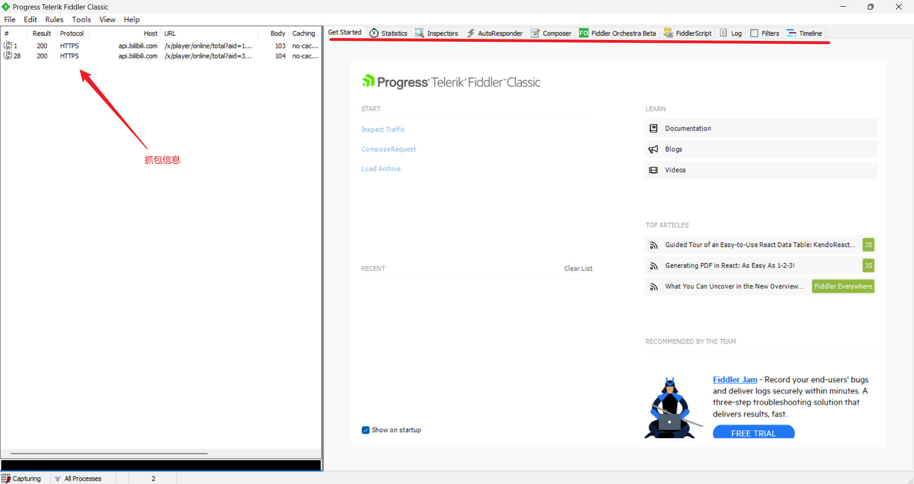
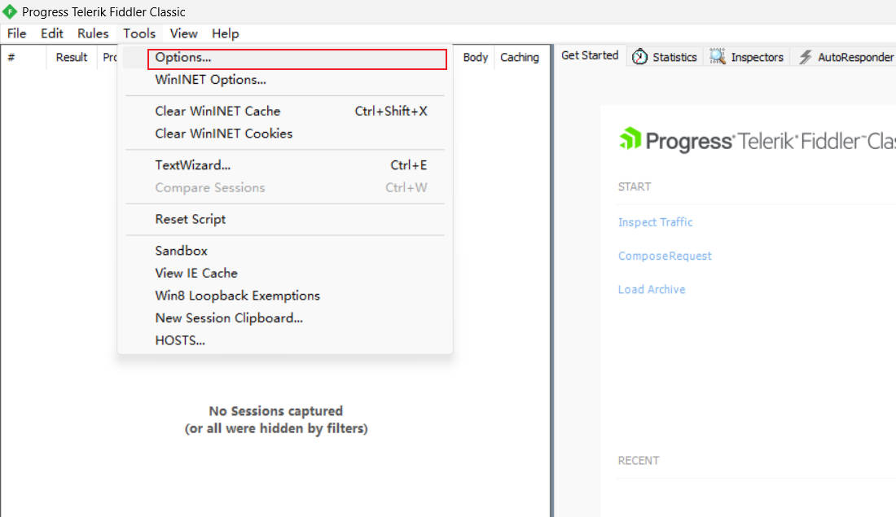
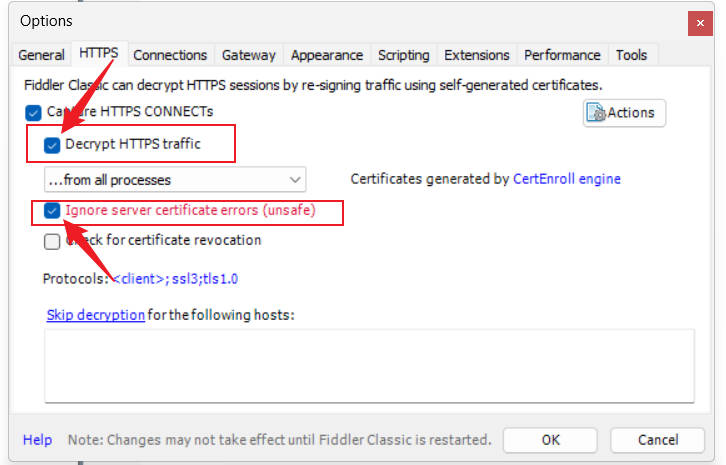
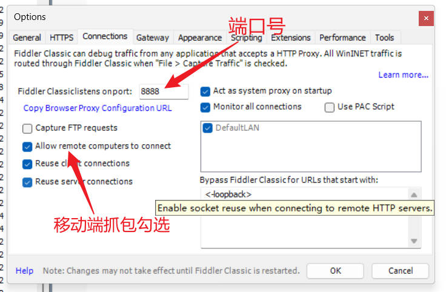
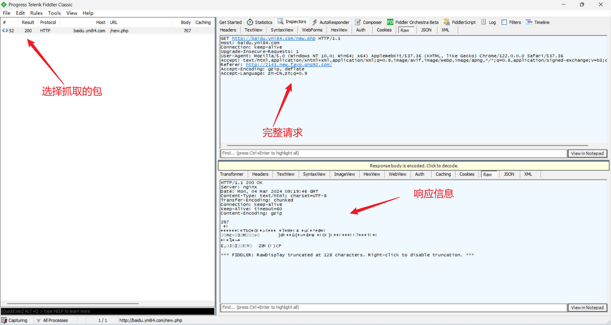
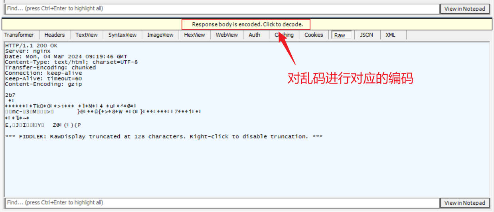
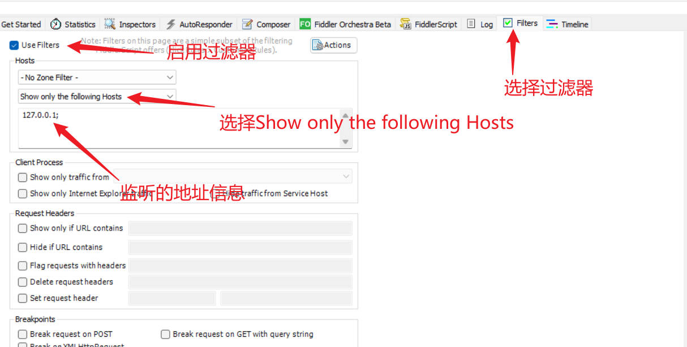
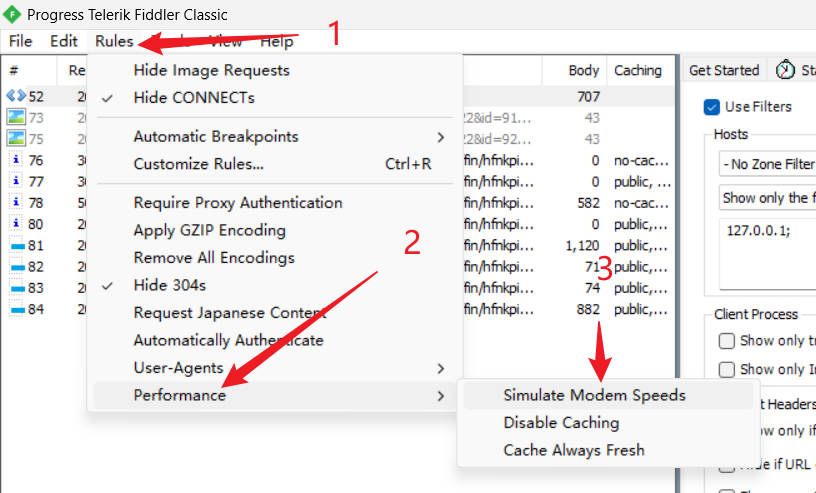
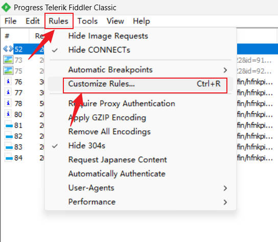

# Fiddler教程
---
#### 前言
以下内容仅为个人学习Fiddler的经验，仅作为入门参考。若需深造，请自行查阅官方文档或教程。

#### 一、界面

左侧可以查看抓取的包，右侧可以查看抓包的具体信息，包括请求头、请求体、响应头、响应体等等。

#### 二、基本配置
打开options

勾选下图的
- [ ] Decrypt HTTPS traffic
- [ ] Ignore server certificate errors(unsafe)


修改端口号和移动端抓包设置如下


#### 三、查看抓包信息

响应信息有时可能出现乱码，可以点击decode进行编码


#### 四、filters过滤器
使用过滤器过滤不需要的信息或者选择监听指定地址的包信息


#### 五、弱网测试
点击Rules，选择performance中的
**Simulate Moderm Speeds**


在Rules-Customize Rules中修改代码


``` python
if (m_SimulateModem) {
    # Delay sends by 300ms per KB uploaded.
    oSession["request-trickle-delay"] = "300"; 
    # Delay receives by 150ms per KB downloaded.
    oSession["response-trickle-delay"] = "150"; 
        }
```